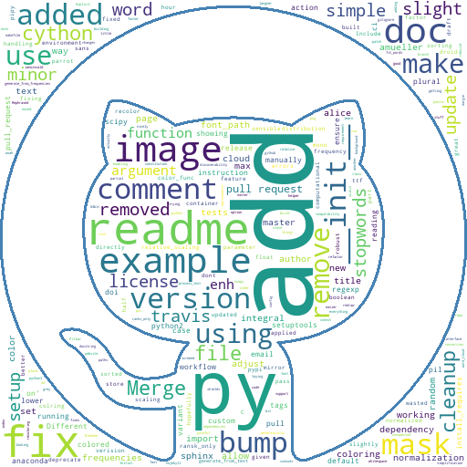

# Word Cloud Generator from Users Commit Messages

This is a simple script to generate a word cloud from the commit messages of a user, from a given repository.

## Usage

```bash wordcloud.sh <username> <repository> <branch> <mask image> <output image path>```

* username: The username of the user to generate the word cloud from.
* repository: The repository to generate the word cloud from.
* branch: The branch to generate the word cloud from.
* mask image: The image to use as a mask for the word cloud.
* output image path: The path to save the generated word cloud.

## Example

```bash wordcloud.bash amueller https://github.com/amueller/word_cloud.git master Github.png Test.png```



## Requirements
wordcloud: www.github.com/amueller/word_cloud
python: www.python.org
